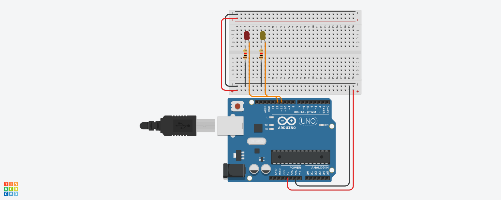
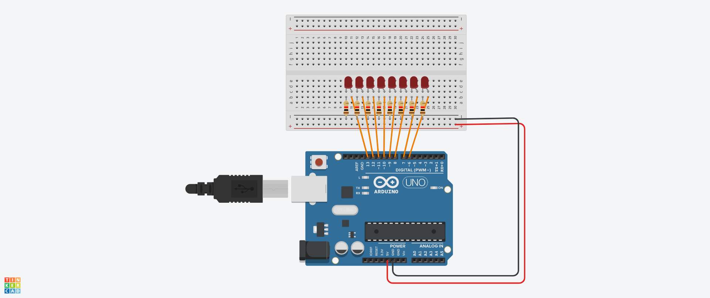
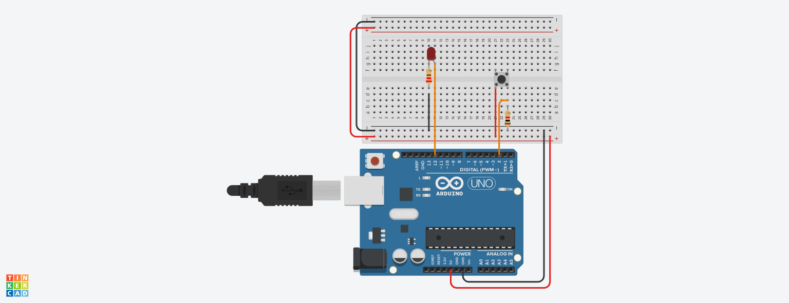
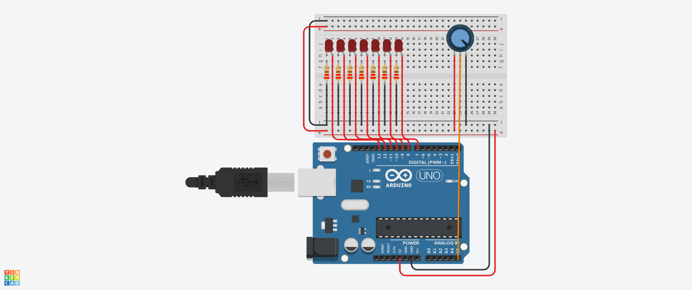
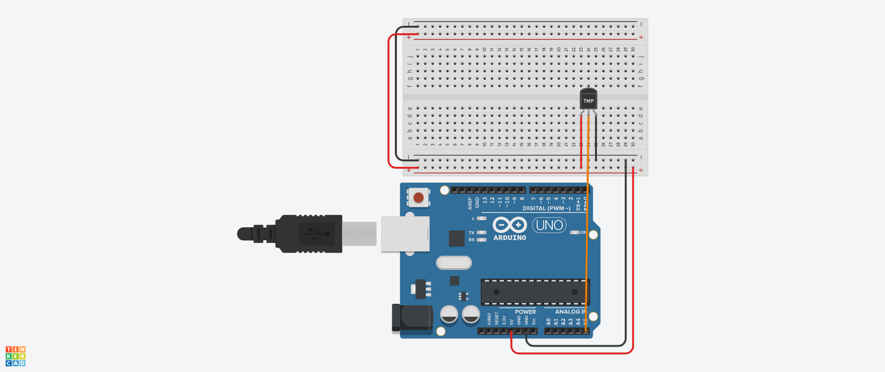
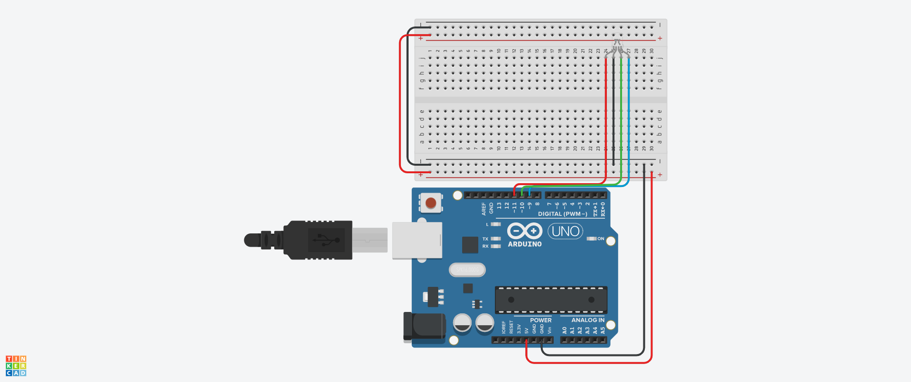

# ARDUINO Avans

This is a project to get familiar with Arduino and to learn it. In this project, I created 6 circuits with some code behind it. I'll walk you trough with how I did this.

### Getting Started
I put the code of all circuits and their corresponding pictures in an assignment folder (Ranging from 1 to 6). Simply just set them up and it should work.

### Prequistes
- Arduino Uno (It's what this project was done on)
- M-M cables
- F-M cables
- Breadboard (Not necessary)
- Arduino IDE
- C++ knowledge
- LEDs
- 220 ohm resistors
- Button
- Potentio meter
- Heat sensor
- RGB Led (mine had built in resistors)

## Assignment 1
For this assignment I had to connect 2 LED's on port 11 and 12. These LED's had to flicker alternatively.

## Assignment 2
For this assignment I had to recreate the Knight Rider car headlight effect.

## Assignment 3
For this assignment I had to connect a LED to port 11 and use a button as a switch.

## Assignment 4
For this assignment I had to connect a potmeter and display it's rotation on 7 LED's

## Assignment 5
For this assignment I had to connect a heat sensor and display it's temprature.

## Assignment 6
For this assignment I had to connect an RGB led and display every color on it.

